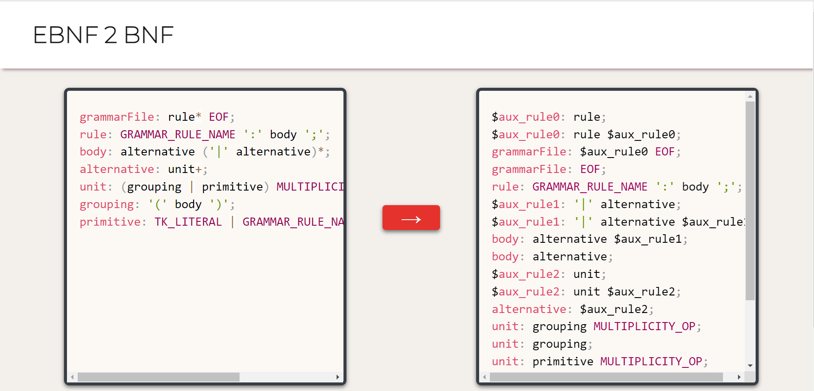

# EBNF2BNF
Translator from EBNF (extended Backus-Naur Form) to simple BNF, for grammar analysis and design purposes.

## Usage



Once you've accessed the web page, you can enter your EBNF rules in the text box on the left. Rules generally follow the [ANTRL format](https://github.com/antlr/antlr4/blob/master/doc/parser-rules.md) for lexical rules. In simple terms, a rule has the form `rule_name: body;`.
* the rule name starts with lowercase
* a colon separates the name from the body
* a semicolon marks the end of the rule
* the body is composed of string literals delimited by single quotes `'`, or by lexical/grammatical rule names
* whitespace is used for formatting
* You can use parenthesis, and the operators `+`, `*`, `?` and `|` as you would expect from regexes or from the specification linked above

After writing all your EBNF rules, click the `->` button in the middle, and get in the box on the right the equivalent BNF rules, which make no use of the special operators (`+`, `*`, `?`, `|`).

## Development Set up

### Development dependencies

* [Node/npm](https://nodejs.org/en/download/)
* [Java](https://openjdk.org/install/)
* The complete [ANTLR runtime](https://www.antlr.org/download.html)

You only need Java and the ANTLR runtime to modify the grammar and generate a new recognizer from it. To build the website, or just modify the Visitor that carries out the translation, you only need npm.

### ANTLR CLI aliasing

Use the following aliases, either directly in the terminal or in the respective `.rc` file. Remember to use the suitable path if you're not using `/usr/local/lib/` to host the runtime, as in the example.

```shell
$ export CLASSPATH=".:/usr/local/lib/antlr-4.10.1-complete.jar:$CLASSPATH"
$ alias antlr4='java -Xmx500M -cp "/usr/local/lib/antlr-4.10.1-complete.jar:$CLASSPATH" org.antlr.v4.Tool'
```

And now you can use generate the recognizer files with the provided npm script, from the root of the project.

```shell
$ npm run generate
```

### Installing deps and Building

Clone the repo and install the javascript dependencies with npm. This includes the ANTLR JS target (different to the runtime) and dev dependencies to bundle the recognizer + Visitor code.

```shell
$ git clone https://github.com/ccgarciab/ebnf2bnf
$ cd ebnf2bnf
$ npm install
```

Then build the repo using the provided npm scripts. Use `build` for a development build and `build-prod` for production.

```shell
$ npm run build
$ npm run build-prod
```

Then enter the file location in your browser, or use a web server of your preference.
