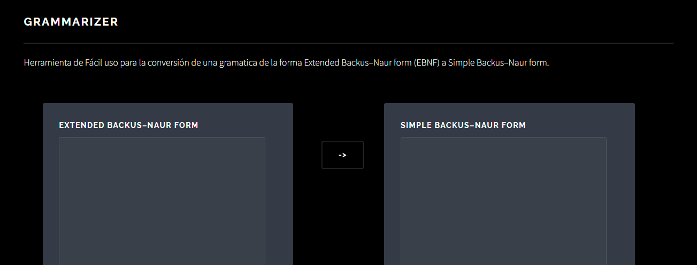

# Grammarizer
A formal grammar manipulation tool

## Usage

### Set up

Clone the repo, setup the python virtualenv and install dependencies. Then execute `main.py` with python.

```shell
$ git clone https://github.com/ccgarciab/grammarizer
$ python3 -m venv
$ source .venv/bin/activate # Script instead of bin in Windows
$ pip install -r requirements.txt
$ python main.py
```

Then enter [`localhost:8888`](http://localhost:8888) in your browser.

### Using the GUI



Once you've accessed the web page, you can enter your EBNF rules in the text box on the left. Rules generally follow the [ANTRL format](https://github.com/antlr/antlr4/blob/master/doc/parser-rules.md) for lexical rules. In simple terms, a rule has the form `rule_name: body;`.
* the rule name starts with lowercase
* a colon separates the name from the body
* a semicolon marks the end of the rule
* the body is composed of string literals delimited by single quotes `'`, or by lexical/grammatical rule names
* whitespace is used for formatting
* You can use parenthesis, and the operators `+`, `*`, `?` and `|` as you would expect from regexes or from the specification linked above

After writing all your EBNF rules, click the `->` button in the middle, and get in the box on the right the equivalent BNF rules, which make no use of the special operators (`+`, `*`, `?`, `|`).

## Development Setup

### Development dependencies

* [Java](https://openjdk.org/install/)
* The complete [ANTLR runtime](https://www.antlr.org/download.html)

### ANTLR setup

#### Option A: Use Intellij

* Download Intellij
* Download the ANTLR4 plugin
* In the grammar file, right click, configure ANTLR
* Configure Python3 as output language

#### Option B: configure the ANTLR CLI

```shell
$ export CLASSPATH=".:/usr/local/lib/antlr-4.9.3-complete.jar:$CLASSPATH"
$ alias antlr4='java -Xmx500M -cp "/usr/local/lib/antlr-4.9.3-complete.jar:$CLASSPATH" org.antlr.v4.Tool'
$ alias grun='java -Xmx500M -cp "/usr/local/lib/antlr-4.9.3-complete.jar:$CLASSPATH" org.antlr.v4.gui.TestRig'
```

And now you can use ANTLR as

```shell
$ antlr4 -Dlanguage=Python3 grammar/grammarizer.g4
```

### Final steps

Follow the usage set up instructions, and hack away.
